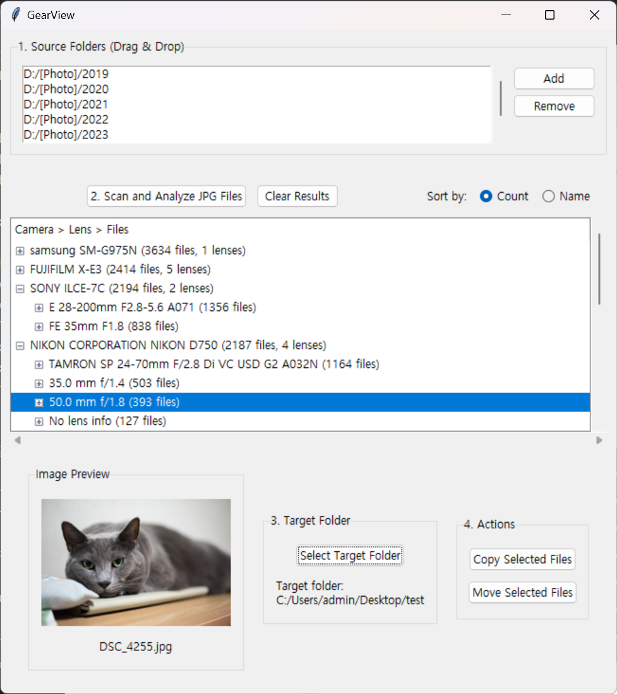

# GearView

## Overview

This app can be used when you want to collect and view only photos taken with a specific camera or lens from all the photos you have taken.

**Supported File Format**: JPG/JPEG files only

## Getting Started

**System Requirements**: Windows only

1. Download the latest `GearView.exe` from the [releases page](https://github.com/newboon/GearView/releases)
2. Run the downloaded executable file
3. No installation required - the app runs directly

## Usage

1. **Select Source Folders**: Add folders containing images to analyze
2. **Scan and Analyze**: Scan JPEG files and analyze EXIF data
3. **Select Target Folder**: Choose folder to save organized files
4. **File Operations**: Select desired files/groups to copy or move

## Screenshot

## License

This project is distributed under the MIT License. See the [LICENSE](LICENSE) file for details.
